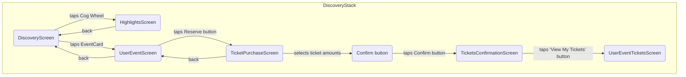
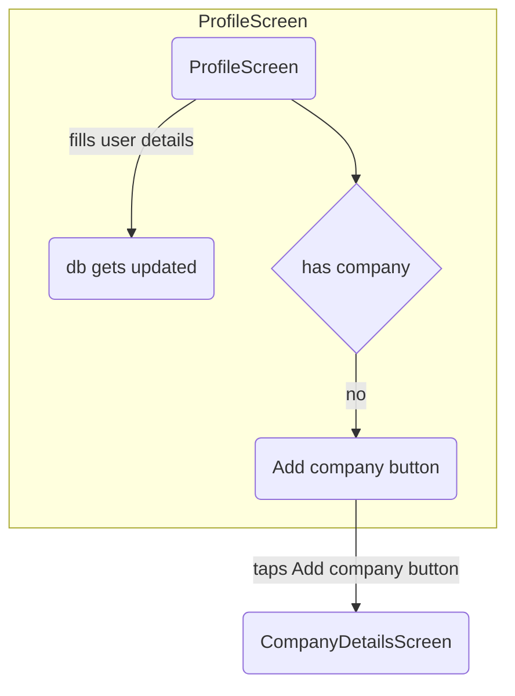
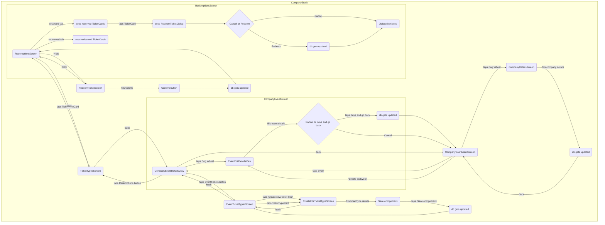

# Testing Strategy 
### Unit Tests
These tests are performed on components/functions at the lowest level of abstraction. They are used to test the functionality of a single component. They are also used to test the functionality of a component in isolation from other components. Unit tests are written using the [Jest](https://jestjs.io/) framework. 

Tests that fall in this category are:
* [components](#components-testing-guide)
  * `atoms`
  * `molecules` (whenever they don't import any atoms)
  * `forms`
* [functions / hooks](#functions-testing-guide)
  * firebase functions
  * helpers

#### Components testing guide:
* Inputs / Outputs (I/O) - assert that the component renders the correct output given a set of props
* User Interactions - assert that the component responds to user interactions correctly
* Event Handlers - assert that the component calls prop functions correctly (e.g. `onClick`, `onSubmit`, etc.)

#### Functions testing guide:
* Inputs / Outputs (I/O) - assert that the function returns the correct output given a set of inputs
* Edge cases - assert that the function handles edge cases correctly (e.g. `null`, `undefined`, etc.)

### Integration Tests
These tests are performed on components/functions at the highest level of abstraction. They are used to test the functionality of a component in conjunction with other components. Integration tests are performed by testing Screens, which are the highest level of abstraction in the app.

Tests that fall in this category are:
* [screens](#screens-testing-guide)

#### Screens testing guide (WIP)
* navigation - assert that the screen navigates to the correct screen when a user clicks on a button
* inputs / outputs (I/O) - assert that the screen renders the correct output given a set of props (e.g. navigation/route params)
* side effects - for example, assert that the screen calls the correct firebase function when a user clicks on a button

### Reference
* [What should we test (ReactJS Components)](https://hackernoon.com/what-should-we-test-reactjs-components-647ded674928)
* [Where and how to start testing 🧪 your react-native app ⚛️ and how to keep on testin’](https://medium.com/@stevegalili/where-and-how-to-start-testing-your-react-native-app-%EF%B8%8F-and-how-to-keep-on-testin-ec3464fb9b41)
* [Static vs Unit vs Integration vs E2E Testing for Frontend Apps](https://kentcdodds.com/blog/static-vs-unit-vs-integration-vs-e2e-tests)

# User flows

### Discovery


### Search
```mermaid
graph TD;
subgraph SearchScreen
  J(SearchScreen)
  J-->|taps Cog Wheel|K(SearchFilterScreen)
  K-->|slides distance filter|L(db gets updated)
  K-->|switches event categories|L(db gets updated)
  K-->|back|J(SearchScreen)
end
  ```

### User Tickets
```mermaid
graph TD;
subgraph UserTicketsStack
  M(UserTicketsScreen)
  M-->|taps UserEventCard|N(UserEventTicketsScreen)

  N(UserEventTicketsScreen)
  N-->|back|M(UserTicketsScreen)
  N-->|sees|O(Tickets for the particular event)
end
```

### Profile


### Company

